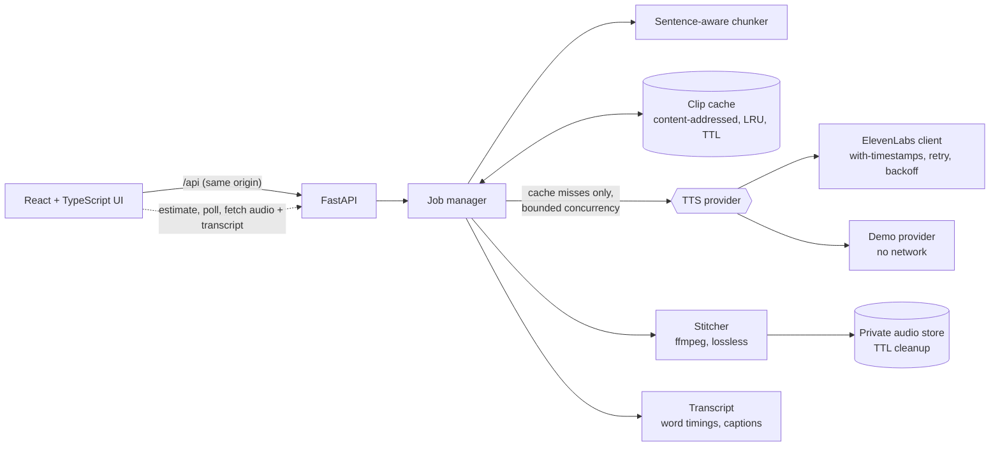

# ChapterCast

Turn a chapter of text into a narrated audiobook with the [ElevenLabs](https://elevenlabs.io) text-to-speech API.

[](https://github.com/robbe1999/chaptercast/actions/workflows/ci.yml)
[](https://github.com/robbe1999/chaptercast/actions/workflows/security.yml)


> Unofficial project. Not affiliated with or endorsed by ElevenLabs.

Paste or import a chapter, pick a voice, see what it will cost, then play it back with a word-by-word read-along and download the audio and captions. The interesting part is everything between "paste" and "play": splitting text at natural boundaries, calling the API concurrently without tripping its limits, surviving transient failures, keeping prosody continuous across chunk boundaries, never paying twice for the same sentence, and doing all of it without putting the API key, or your credits, at risk.

### Features

| | |
|---|---|
| **Read-along transcript** | Every word is highlighted as it is spoken; click any word to jump there. Timings come from the ElevenLabs `/with-timestamps` endpoint, merged across chunks. |
| **Captions** | Download `.srt` or `.vtt` subtitles, cut at sentence boundaries with standard readability limits. |
| **Smart re-generation** | Each section is cached by a hash of everything that affects its audio. Fix a typo and only that section (and its two neighbours, whose context changed) is paid for again. |
| **Cost before you pay** | A live estimate shows sections, how many are already cached, credits for the chosen model and the remaining daily budget. |
| **Model and voice tuning** | Pick from the live model list (with its credit multiplier, e.g. Flash at 0.5×), limited by an operator allowlist. Adjust stability, similarity, style and speed. |
| **Voice previews** | Hear a voice before spending a single credit, with its accent, age and use-case labels. |
| **Import** | Drop in a `.txt` or `.md` file. Markdown is turned into narration text: headings become sentences, links keep their text, code and URLs are dropped. |

**It runs with zero configuration.** With no API key it starts in demo mode: the full pipeline executes, but each word becomes a synthetic tone instead of speech, so anyone can try it for free and tests never touch the network.

## Quick start

```bash
git clone https://github.com/robbe1999/chaptercast && cd chaptercast
make setup            # python venv (needs Python 3.11+) + npm ci
make dev-api          # terminal 1: API on :8000 (demo mode)
make dev-web          # terminal 2: UI on http://localhost:5173
```

Or in a hardened container: `docker compose up --build` and open http://127.0.0.1:8000.

### Using real ElevenLabs voices

```bash
cp .env.example .env
# edit .env: set ELEVENLABS_API_KEY (and CHAPTERCAST_ACCESS_TOKEN if the server is reachable by others)
make dev-api
```

`make dev-api` runs from the repository root, so it reads the root `.env`. `.env` is gitignored. The key is read once at startup, held as a `SecretStr`, sent only to `api.elevenlabs.io`, and never returned, logged or bundled into the frontend. See [Security](#security).

## How it works



1. **Chunk.** Text is normalised, then split on paragraph, sentence, clause, word, and finally hard-slice boundaries, in that order of preference, so no chunk ends mid-sentence unless it has to. Abbreviations (`Dr.`) and initials (`J. R. R.`) do not end sentences. Property-based tests guarantee that every chunk is within the size limit and that no content is lost or reordered.
2. **Plan.** Each chunk gets a SHA-256 cache key over provider, model, voice, settings, output format, its text and its neighbouring context. Chunks already in the cache are free; only the rest are reserved against the daily budget. `POST /api/estimate` runs exactly this plan without spending anything, which is what powers the live cost line in the UI.
3. **Synthesise.** Cache misses are sent concurrently, bounded by a semaphore shared across all jobs so the provider's concurrency limits are respected. Each request carries the neighbouring text (`previous_text` / `next_text`), which the API uses to keep intonation continuous across stitched segments.
4. **Recover.** Timeouts, 5xx and 429 are retried with exponential backoff and full jitter, honouring `Retry-After`. Auth, quota and validation errors fail fast. The first failure cancels the sibling chunks so a doomed job stops spending credits.
5. **Stitch and align.** Clips are joined in order (ffmpeg `-c copy`, no re-encode, when available), written atomically to a private directory, and served with Range support so seeking works. Each clip's per-character timings are shifted by the duration of the audio before it and grouped into words, giving chapter-level timings for the read-along view and the caption files. Against the real API, the last word of a test chapter ended 50 ms before the end of the ffprobe-measured audio.
6. **Clean up.** Audio is deleted when the user starts over, or after a TTL. Cached sections expire after a day (configurable) and are evicted least-recently-used beyond a size cap. Orphans from a previous process are purged at startup.

More detail, including the scaling path, is in [docs/ARCHITECTURE.md](docs/ARCHITECTURE.md).

## API

Interactive docs are off by default; enable with `CHAPTERCAST_ENABLE_DOCS=true` and open `/docs`. The committed contract is [docs/openapi.json](docs/openapi.json), and a test fails if it drifts from the code.

| Method | Path | Purpose |
|---|---|---|
| `GET` | `/api/config` | Public client config (provider, limits, whether a token is required) |
| `GET` | `/api/voices` | Available voices, with labels and a preview link |
| `GET` | `/api/voices/{id}/preview` | A short, free sample of a voice |
| `GET` | `/api/models` | Models this server offers, with credit multipliers |
| `POST` | `/api/estimate` | Dry-run a job: sections, cache hits, credits, remaining budget |
| `POST` | `/api/jobs` | Start a job (`text`, `voice_id`, optional `model_id` and `voice_settings`). Returns `202` with a `Location` header |
| `GET` | `/api/jobs/{id}` | Status, per-chunk progress, cache reuse and billed characters |
| `GET` | `/api/jobs/{id}/audio` | The finished audio (Range supported) |
| `GET` | `/api/jobs/{id}/transcript` | Word-level timings for the read-along view |
| `GET` | `/api/jobs/{id}/captions.srt`, `.vtt` | Caption files |
| `DELETE` | `/api/jobs/{id}` | Cancel and delete the audio |
| `GET` | `/healthz`, `/readyz` | Liveness and readiness |

Errors share one shape, with a stable machine-readable `code` and a request id for correlation:

```json
{ "error": { "code": "text_too_long", "message": "Text is 6120 characters; the limit is 5000.", "request_id": "..." } }
```

## Security

The threat model is in [docs/SECURITY.md](docs/SECURITY.md). The short version:

| Concern | What is done |
|---|---|
| API key exposure | Server-side only. `SecretStr` config, no `VITE_` variables, redacting JSON logger, validation errors that never echo secret input. CI fails if the built bundle contains credential strings. |
| Key exfiltration via config | The provider base URL must be `https` on `elevenlabs.io`. Redirects are never followed. Voice ids are strictly validated before entering a URL path. |
| Key or SSRF via voice previews | Previews are fetched by a separate HTTP client that has no API key, only from an allowlisted CDN host over HTTPS, only for URLs the API returned, without redirects, size-capped, and served with a content type derived from the audio bytes, never from the CDN's header. |
| Credit exhaustion | Per-job and daily character budgets (only cache misses are charged; anything not billed is refunded), per-client rate limits, concurrency and queue caps, and an operator allowlist of models. |
| Cached audio | File names are hashes, so the cache reveals no text. Entries expire and are size-bounded. Set `CHAPTERCAST_CACHE_MAX_MB=0` to disable caching entirely. |
| Unauthorised use | Optional bearer token, compared in constant time, with failed-attempt lockout that also blocks a correct token during the lockout. |
| Web attacks | Strict CSP with no inline script or style, `frame-ancestors 'none'`, `nosniff`, no CORS by default, request body limits. |
| Secrets in git | `.env` gitignored, a dependency-free local scanner (also a test), gitleaks over full history in CI, pre-commit hooks. |
| Supply chain | Locked, pinned dependencies, `pip-audit` and `npm audit` in CI, Dependabot, CodeQL, least-privilege workflow tokens. |
| Container | Non-root, read-only filesystem, all capabilities dropped, `no-new-privileges`, resource limits, bound to localhost. |

## Configuration

Everything is an environment variable (or a local `.env`). Defaults are safe for local use.

| Variable | Default | Meaning |
|---|---|---|
| `ELEVENLABS_API_KEY` | none | Enables the real provider. Never commit it. |
| `CHAPTERCAST_PROVIDER` | `auto` | `auto`, `elevenlabs` or `demo` |
| `CHAPTERCAST_ACCESS_TOKEN` | none | Require `Authorization: Bearer` (min 16 chars) |
| `CHAPTERCAST_MAX_CHARS_PER_JOB` | `5000` | Per-job character cap |
| `CHAPTERCAST_DAILY_CHAR_BUDGET` | `25000` | Global daily cap, resets 00:00 UTC |
| `CHAPTERCAST_CHUNK_MAX_CHARS` | `900` | Target chunk size |
| `CHAPTERCAST_TTS_CONCURRENCY` | `3` | Parallel provider calls across all jobs |
| `CHAPTERCAST_MAX_CONCURRENT_JOBS` / `MAX_ACTIVE_JOBS` | `2` / `5` | Running jobs / running plus queued |
| `CHAPTERCAST_JOBS_PER_MINUTE` | `10` | Per-client job creation rate |
| `CHAPTERCAST_JOB_TTL_SECONDS` | `3600` | How long finished audio is kept |
| `CHAPTERCAST_ELEVENLABS_MODEL_ID` | `eleven_multilingual_v2` | Default model (always allowed) |
| `CHAPTERCAST_ALLOWED_MODELS` | `eleven_multilingual_v2,eleven_flash_v2_5,eleven_turbo_v2_5` | Models users may pick. Each must support context stitching and timestamps |
| `CHAPTERCAST_CACHE_MAX_MB` | `100` | Size cap of the clip cache; `0` disables it |
| `CHAPTERCAST_CACHE_TTL_SECONDS` | `86400` | How long cached sections are reused |
| `CHAPTERCAST_ELEVENLABS_OUTPUT_FORMAT` | `mp3_44100_128` | MP3 formats only |
| `CHAPTERCAST_TRUST_PROXY_HEADERS` | `false` | Set only behind a proxy you control |
| `CHAPTERCAST_CORS_ORIGINS` | none | Only if the UI is on another origin |
| `CHAPTERCAST_ENABLE_DOCS` | `false` | Serve `/docs` |

## Development

```bash
make check      # lint, strict types, all tests, secret scan: what CI runs
make test-api   # pytest with coverage (fails under 85%)
make test-web   # vitest
make openapi    # regenerate docs/openapi.json after an API change
```

**Backend** (`backend/chaptercast`): Python 3.11+, FastAPI, httpx, pydantic v2. `ruff` and `mypy --strict` are enforced.
**Frontend** (`frontend/src`): React 18, TypeScript (`strict`, `noUncheckedIndexedAccess`), Vite. Responses are validated at runtime with zod. One stylesheet built on design tokens (light and dark), self-hosted Inter, and an app-style two-column layout on desktop that stacks on mobile.

What the tests cover, beyond the happy path:

- Chunker invariants under random Unicode input (Hypothesis), including that every paragraph break survives chunking.
- Transcript merging: offsets across clips, paragraphs across chunk boundaries, words covering all text in order (Hypothesis); caption cue limits, wrapping, SRT/WebVTT formatting and markup escaping.
- Cache: every input changes the key, TTL without read-extension, LRU eviction, corrupt entries as misses, path-shaped keys rejected; edits re-generate exactly the changed chunk and its neighbours; budget never double-charged when a predicted hit vanishes.
- ElevenLabs client: the documented `/with-timestamps` request and response, malformed or mismatched alignment degrading to "no transcript", model filtering, and preview fetching that never sends the key or follows a URL off the allowlist.
- Retry policy: which statuses retry, `Retry-After` capping, backoff bounds, no retry on auth, quota or 4xx.
- Job manager: output order when chunks finish out of order, bounded concurrency, failure cancels siblings, budget refunds, TTL expiry, eviction, shutdown.
- API: auth, lockout, spoofed `X-Forwarded-For`, rate limit, budget, body limits, security headers, error shape, no echo of submitted text, no secret in any response or log line.
- Frontend: polling, backoff, abort on cancel and unmount, object-URL cleanup, the auth gate, accessible status updates, debounced and abortable estimates, Markdown to narration, file import errors, voice previews, remembered preferences, the read-along highlight and click-to-seek.

## Project layout

```
backend/chaptercast/
  config.py          validated settings, secrets as SecretStr
  chunking.py        sentence-aware splitter, paragraph-aware chunks
  providers/         TTSProvider protocol, ElevenLabs client, demo provider
  jobs.py            planning, lifecycle, concurrency, budget accounting, cleanup
  cache.py           content-addressed clip cache (LRU + TTL)
  transcript.py      chapter-level word timings, SRT and WebVTT
  audio.py           duration estimates, lossless stitching
  guards.py          rate limiter, daily budget
  middleware.py      request id + access log, security headers, body limits
  deps.py, api.py    auth dependency and routes
  main.py            app factory
frontend/src/
  api/               typed client + zod schemas mirroring the OpenAPI contract
  hooks/             useJob (submit/poll/fetch), useEstimate (debounced), usePlaybackTime
  components/        composer pieces, voice picker, narration settings, read-along
  lib/               Markdown to narration, preferences, downloads
docs/                architecture, security model, OpenAPI snapshot
scripts/             secret scanner
```

## Limitations and next steps

This is a single-instance design, chosen deliberately to keep the moving parts visible. Known limits:

- **Job state is in memory.** A restart drops running jobs. Scaling out needs a shared queue and object storage (see the architecture doc for the path).
- **Rate limiting is per process** and keyed by client address; behind a proxy it needs `CHAPTERCAST_TRUST_PROXY_HEADERS`.
- **No user accounts.** Access is a single shared token; a job id is an unguessable capability, not an identity.
- **Audio is available only after the whole job finishes.** Progressive playback as chunks complete is the obvious next step.
- **Text is sent to a third party** (the speech provider) to generate audio. Do not submit content you are not allowed to share. Check the provider's terms and your plan's data-retention settings.

- **The cache is shared by everyone using the server.** That is what makes it useful, but it also means a user could tell (from an estimate) that someone else recently generated the exact same text with the same voice and settings. For a shared deployment behind one access token that is acceptable; for a multi-tenant one, the key would need a per-user salt.
- **Editing a sentence also re-generates its neighbours**, because their `previous_text`/`next_text` context changed. That is a deliberate choice of consistency over savings.

Ideas: progressive streaming playback, per-speaker voices for dialogue, ElevenLabs pronunciation dictionaries, EPUB import with chapter detection, Prometheus metrics, generating the frontend types from the OpenAPI document.

## License

[MIT](LICENSE)
