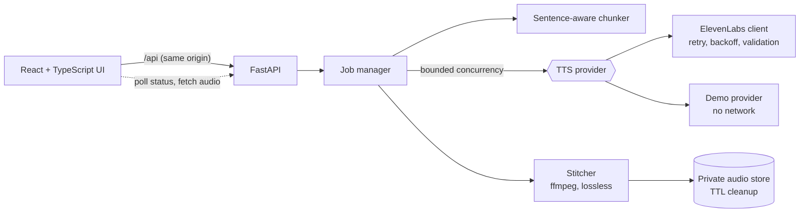

# ChapterCast

Turn a chapter of text into a narrated audiobook with the [ElevenLabs](https://elevenlabs.io) text-to-speech API.

[](https://github.com/robbe1999/chaptercast/actions/workflows/ci.yml)
[](https://github.com/robbe1999/chaptercast/actions/workflows/security.yml)


> Unofficial project. Not affiliated with or endorsed by ElevenLabs.

Paste text, pick a voice, watch progress, play or download the result. The interesting part is everything between "paste" and "play": splitting text at natural boundaries, calling the API concurrently without tripping its limits, surviving transient failures, keeping prosody continuous across chunk boundaries, and doing all of it without putting the API key, or your credits, at risk.

**It runs with zero configuration.** With no API key it starts in demo mode: the full pipeline executes, but each word becomes a synthetic tone instead of speech, so anyone can try it for free and tests never touch the network.

## Quick start

```bash
git clone https://github.com/robbe1999/chaptercast && cd chaptercast
make setup            # python venv + npm ci
make dev-api          # terminal 1: API on :8000 (demo mode)
make dev-web          # terminal 2: UI on http://localhost:5173
```

Or in a hardened container: `docker compose up --build` and open http://127.0.0.1:8000.

### Using real ElevenLabs voices

```bash
cp .env.example .env
# edit .env: set ELEVENLABS_API_KEY (and CHAPTERCAST_ACCESS_TOKEN if the server is reachable by others)
make dev-api
```

`.env` is gitignored. The key is read once at startup, held as a `SecretStr`, sent only to `api.elevenlabs.io`, and never returned, logged or bundled into the frontend. See [Security](#security).

## How it works



1. **Chunk.** Text is normalised, then split on paragraph, sentence, clause, word, and finally hard-slice boundaries, in that order of preference, so no chunk ends mid-sentence unless it has to. Abbreviations (`Dr.`) and initials (`J. R. R.`) do not end sentences. Property-based tests guarantee that every chunk is within the size limit and that no content is lost or reordered.
2. **Synthesise.** Chunks are sent concurrently, bounded by a semaphore shared across all jobs so the provider's concurrency limits are respected. Each request carries the neighbouring text (`previous_text` / `next_text`), which the API uses to keep intonation continuous across stitched segments.
3. **Recover.** Timeouts, 5xx and 429 are retried with exponential backoff and full jitter, honouring `Retry-After`. Auth, quota and validation errors fail fast. The first failure cancels the sibling chunks so a doomed job stops spending credits.
4. **Stitch.** Clips are joined in order (ffmpeg `-c copy`, no re-encode, when available), written atomically to a private directory, and served with Range support so seeking works.
5. **Clean up.** Audio is deleted when the user starts over, or after a TTL. Orphans from a previous process are purged at startup.

More detail, including the scaling path, is in [docs/ARCHITECTURE.md](docs/ARCHITECTURE.md).

## API

Interactive docs are off by default; enable with `CHAPTERCAST_ENABLE_DOCS=true` and open `/docs`. The committed contract is [docs/openapi.json](docs/openapi.json), and a test fails if it drifts from the code.

| Method | Path | Purpose |
|---|---|---|
| `GET` | `/api/config` | Public client config (provider, limits, whether a token is required) |
| `GET` | `/api/voices` | Available voices |
| `POST` | `/api/jobs` | Start a job. Returns `202` with a `Location` header |
| `GET` | `/api/jobs/{id}` | Status and per-chunk progress |
| `GET` | `/api/jobs/{id}/audio` | The finished audio (Range supported) |
| `DELETE` | `/api/jobs/{id}` | Cancel and delete the audio |
| `GET` | `/healthz`, `/readyz` | Liveness and readiness |

Errors share one shape, with a stable machine-readable `code` and a request id for correlation:

```json
{ "error": { "code": "text_too_long", "message": "Text is 6120 characters; the limit is 5000.", "request_id": "..." } }
```

## Security

The threat model is in [docs/SECURITY.md](docs/SECURITY.md). The short version:

| Concern | What is done |
|---|---|
| API key exposure | Server-side only. `SecretStr` config, no `VITE_` variables, redacting JSON logger, validation errors that never echo secret input. CI fails if the built bundle contains credential strings. |
| Key exfiltration via config | The provider base URL must be `https` on `elevenlabs.io`. Redirects are never followed. Voice ids are strictly validated before entering a URL path. |
| Credit exhaustion | Per-job and daily character budgets (refunded for unspent chunks), per-client rate limit, concurrency and queue caps. |
| Unauthorised use | Optional bearer token, compared in constant time, with failed-attempt lockout that also blocks a correct token during the lockout. |
| Web attacks | Strict CSP with no inline script or style, `frame-ancestors 'none'`, `nosniff`, no CORS by default, request body limits. |
| Secrets in git | `.env` gitignored, a dependency-free local scanner (also a test), gitleaks over full history in CI, pre-commit hooks. |
| Supply chain | Locked, pinned dependencies, `pip-audit` and `npm audit` in CI, Dependabot, CodeQL, least-privilege workflow tokens. |
| Container | Non-root, read-only filesystem, all capabilities dropped, `no-new-privileges`, resource limits, bound to localhost. |

## Configuration

Everything is an environment variable (or a local `.env`). Defaults are safe for local use.

| Variable | Default | Meaning |
|---|---|---|
| `ELEVENLABS_API_KEY` | none | Enables the real provider. Never commit it. |
| `CHAPTERCAST_PROVIDER` | `auto` | `auto`, `elevenlabs` or `demo` |
| `CHAPTERCAST_ACCESS_TOKEN` | none | Require `Authorization: Bearer` (min 16 chars) |
| `CHAPTERCAST_MAX_CHARS_PER_JOB` | `5000` | Per-job character cap |
| `CHAPTERCAST_DAILY_CHAR_BUDGET` | `25000` | Global daily cap, resets 00:00 UTC |
| `CHAPTERCAST_CHUNK_MAX_CHARS` | `900` | Target chunk size |
| `CHAPTERCAST_TTS_CONCURRENCY` | `3` | Parallel provider calls across all jobs |
| `CHAPTERCAST_MAX_CONCURRENT_JOBS` / `MAX_ACTIVE_JOBS` | `2` / `5` | Running jobs / running plus queued |
| `CHAPTERCAST_JOBS_PER_MINUTE` | `10` | Per-client job creation rate |
| `CHAPTERCAST_JOB_TTL_SECONDS` | `3600` | How long finished audio is kept |
| `CHAPTERCAST_ELEVENLABS_MODEL_ID` | `eleven_multilingual_v2` | Model |
| `CHAPTERCAST_ELEVENLABS_OUTPUT_FORMAT` | `mp3_44100_128` | MP3 formats only |
| `CHAPTERCAST_TRUST_PROXY_HEADERS` | `false` | Set only behind a proxy you control |
| `CHAPTERCAST_CORS_ORIGINS` | none | Only if the UI is on another origin |
| `CHAPTERCAST_ENABLE_DOCS` | `false` | Serve `/docs` |

## Development

```bash
make check      # lint, strict types, all tests, secret scan: what CI runs
make test-api   # pytest with coverage (fails under 85%)
make test-web   # vitest
make openapi    # regenerate docs/openapi.json after an API change
```

**Backend** (`backend/chaptercast`): Python 3.11+, FastAPI, httpx, pydantic v2. `ruff` and `mypy --strict` are enforced.
**Frontend** (`frontend/src`): React 18, TypeScript (`strict`, `noUncheckedIndexedAccess`), Vite. Responses are validated at runtime with zod.

What the tests cover, beyond the happy path:

- Chunker invariants under random Unicode input (Hypothesis).
- Retry policy: which statuses retry, `Retry-After` capping, backoff bounds, no retry on auth, quota or 4xx.
- Job manager: output order when chunks finish out of order, bounded concurrency, failure cancels siblings, budget refunds, TTL expiry, eviction, shutdown.
- API: auth, lockout, spoofed `X-Forwarded-For`, rate limit, budget, body limits, security headers, error shape, no echo of submitted text, no secret in any response or log line.
- Frontend: polling, backoff, abort on cancel and unmount, object-URL cleanup, the auth gate, accessible status updates.

## Project layout

```
backend/chaptercast/
  config.py          validated settings, secrets as SecretStr
  chunking.py        sentence-aware splitter
  providers/         TTSProvider protocol, ElevenLabs client, demo provider
  jobs.py            lifecycle, concurrency, budget accounting, cleanup
  audio.py           duration estimates, lossless stitching
  guards.py          rate limiter, daily budget
  middleware.py      request id + access log, security headers, body limits
  deps.py, api.py    auth dependency and routes
  main.py            app factory
frontend/src/        api client + schemas, useJob hook, components
docs/                architecture, security model, OpenAPI snapshot
scripts/             secret scanner
```

## Limitations and next steps

This is a single-instance design, chosen deliberately to keep the moving parts visible. Known limits:

- **Job state is in memory.** A restart drops running jobs. Scaling out needs a shared queue and object storage (see the architecture doc for the path).
- **Rate limiting is per process** and keyed by client address; behind a proxy it needs `CHAPTERCAST_TRUST_PROXY_HEADERS`.
- **No user accounts.** Access is a single shared token; a job id is an unguessable capability, not an identity.
- **Audio is available only after the whole job finishes.** Progressive playback as chunks complete is the obvious next step.
- **Text is sent to a third party** (the speech provider) to generate audio. Do not submit content you are not allowed to share. Check the provider's terms and your plan's data-retention settings.

Ideas: progressive streaming playback, per-speaker voices for dialogue, pronunciation dictionaries, EPUB or Markdown chapter import, Prometheus metrics, generating the frontend types from the OpenAPI document.

## License

[MIT](LICENSE)
