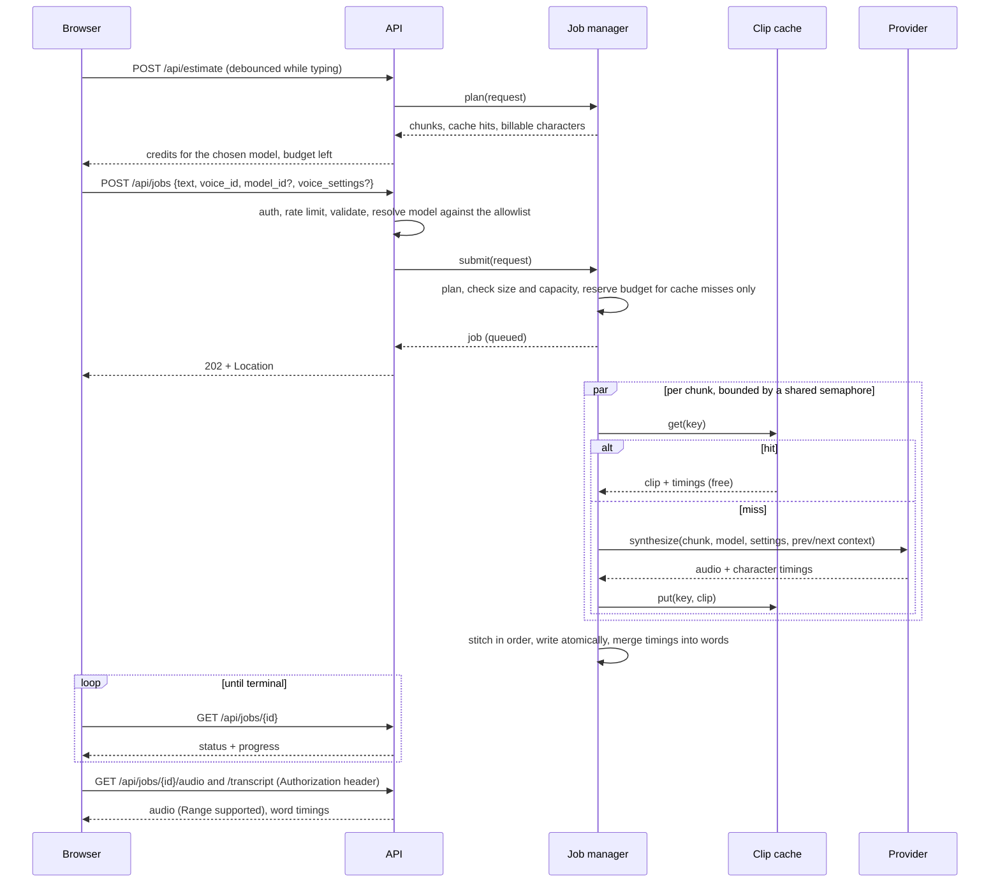

# Architecture

## Goals

1. Make the pipeline from "text" to "audio" correct and observable.
2. Treat the provider API key and credits as the assets worth protecting.
3. Keep the design small enough to read in an afternoon, and honest about where it would change at scale.

## Components

| Component | Responsibility | Why it is separate |
|---|---|---|
| `chunking` | Normalise text, split at natural boundaries | Pure function, so it can be property-tested exhaustively |
| `providers` | `TTSProvider` protocol, ElevenLabs client, demo provider | Provider specifics live in one file; the pipeline is testable offline; demo mode needs no key |
| `jobs` | Planning, lifecycle, concurrency, budget accounting, expiry | The only stateful component; all policy lives here |
| `models` | Model registry: what each model can do and what a character costs | Capabilities are data, so the pipeline never checks model ids |
| `tags` | What counts as an expression tag (`[warm]`) | One definition shared by the chunker, the planner and the transcript |
| `cache` | Content-addressed store of synthesised chunks | Pure key derivation plus a small LRU/TTL store; no policy about *when* to pay |
| `transcript` | Merge per-clip character timings into words; cut captions | Pure functions over plain data, property-tested |
| `audio` | Duration estimates, lossless stitching | Isolates the ffmpeg subprocess and its fallback |
| `guards` | Sliding-window limiter, daily budget | Small, injectable clocks, so they are testable without sleeping |
| `storage` | Atomic, private writes keyed by server-generated ids | No user input ever reaches a filesystem path |
| `middleware` | Request id, access log, security headers, body limits | Cross-cutting, applied to every response including rejections |
| `api`, `deps` | Routes, auth dependency, error mapping | Thin: translate domain errors to HTTP |

## Request flow



## Concurrency model

- One `asyncio` task per job. A **job-slot semaphore** bounds how many jobs run at once.
- A **shared TTS semaphore** bounds outbound provider calls across *all* jobs. Providers enforce per-plan concurrency limits, so the limit belongs to the process, not to a job.
- Chunks of a job run in a `TaskGroup`. The first failure cancels the rest, which both returns the error quickly and stops spending credits on a job that cannot succeed.
- Results are written into a pre-sized list by index, so output order is independent of completion order. A test makes early chunks the slowest to prove it.

## Failure handling

| Failure | Behaviour |
|---|---|
| Timeout, connection error, 5xx | Retry with exponential backoff and full jitter, up to `TTS_MAX_RETRIES` |
| 429 | Retry honouring `Retry-After` (capped at 30 s) |
| 401/403, quota exhausted | Fail fast, no retry. The job fails with a public message; details go only to the redacted log |
| 4xx | Fail fast |
| Non-audio or malformed timestamps response | Treated as upstream failure, never stored |
| Alignment missing, malformed or not matching the text | The audio is kept; the job simply has no transcript. Mapping timings onto the wrong words would be worse than having none |
| Cached chunk expired or evicted between planning and running | Charged at run time; if the daily budget cannot cover it the job fails with `daily_budget_exceeded`, and nothing is double-charged |
| Voice preview unavailable | `503` for that preview only; nothing else is affected |
| Redirect | Never followed, so the key cannot be sent to another host |
| Client cancels | Task cancelled, unspent characters refunded, audio removed |
| Process restart | In-flight jobs are lost. Orphaned files are purged at startup |

## Cost control

Credits are the real blast radius of a leaked or abused endpoint, so cost is bounded at several independent layers: per-job character cap, global daily budget (reserved at submit for cache misses only, and anything not actually billed is refunded), per-client rate limit, active-job cap, stored-job cap and an operator allowlist of models. Any one of them failing open is still limited by the others.

## Model registry and degradation rules

`chaptercast/models.py` describes every offered model as a frozen record: label, description, credits per character, request size limit, latency class, and whether it supports timestamps, context stitching (`previous_text`/`next_text`), style, speaker boost, audio tags and SSML breaks. The ElevenLabs values were checked against the live API ([MODELS.md](MODELS.md)). The provider's live model list only decides *availability*; prices and capabilities come from the registry, and a live price that differs from it is logged. The allowlist (`CHAPTERCAST_ALLOWED_MODELS`) is validated against the registry at startup.

The job carries the model record, and each rule is applied once, where it belongs:

| If the model lacks | Then |
|---|---|
| Context stitching | No `previous_text`/`next_text` is sent, and none is part of the cache key, so editing one section never invalidates its neighbours |
| Timestamps | Plain synthesis instead of `/with-timestamps`; the job reports no word timings, the UI hides the read-along, and transcript or caption requests return 409 with a clear message |
| Style or speaker boost | The setting is dropped before it reaches the provider or the cache key, and the UI disables the control with a title explaining why |
| Audio tags | Tags are removed before chunking, sending and hashing, the estimate reports `tags_ignored`, and the UI tells the user |

A request that is invalid for the chosen model fails with a clear error; the pipeline never falls back to a different model. Sections are capped at both ChapterCast's chunk size and the model's own request limit.

Expression tags get two extra rules. The chunker treats a tag and the word it modifies as one unit, so a tag is never split and never left at the end of a section when the next section has room for it. In the transcript, tag characters (which the API times like any other character, just before the first word) are treated as whitespace, so they never appear as words in the read-along or the captions.

## Smart re-generation

Writers re-generate the same chapter many times: fix a typo, change a name, listen again. Paying for the whole chapter each time is the most expensive thing the app could do, so every chunk is cached under

```
sha256(provider, output format, model, voice, voice settings, text, previous_text, next_text)
```

- **Everything that changes the audio is in the key**, so a hit is guaranteed to be the same request. Changing model, voice or a single slider is a miss.
- **Context is in the key too** (for models that use context). Editing one sentence therefore re-generates that chunk *and its two neighbours*, whose `previous_text`/`next_text` changed. Leaving context out would save a little more but could stitch audio generated against text that no longer exists. Consistency won.
- **Planning is a pure lookup.** `JobManager.plan` chunks the text and checks which keys exist. It never spends, so the same function backs both `POST /api/estimate` and the budget reservation in `submit`.
- **Storage** is two files per entry (audio, then metadata containing format, size and timings), written atomically, metadata last, so a half-written entry is a miss. Expiry is judged by creation time and is *not* extended by reads; least-recently-used entries are evicted beyond the size cap.

## Read-along timings

The `/with-timestamps` endpoint returns per-character start and end times relative to *that clip*. To get chapter-level timings:

1. Walk the clips in playback order. Each clip's offset is the summed duration of the clips before it (exact for WAV, derived from the constant bitrate for MP3).
2. Group characters into words on whitespace. A clip boundary is always a word boundary.
3. Track paragraphs from blank lines inside a chunk, and from a `starts_paragraph` flag the chunker sets when a paragraph break falls exactly on a chunk boundary (a property test checks that every paragraph start is accounted for).

Captions are cut from the word list, preferring sentence ends, with at most two lines of 42 characters and about six seconds per cue. WebVTT text is HTML-escaped, since cue text is markup.

The demo provider renders its tones itself, so its alignment is exact. That makes it the oracle for the end-to-end transcript tests.

## Design decisions

- **Same-origin `/api`, no CORS by default.** In development Vite proxies to the API; in production FastAPI serves the built frontend. The browser never needs the provider's origin or a credential, and there is no cross-origin surface to configure wrongly.
- **Audio fetched with a header, played from a `blob:` URL.** `<audio src>` cannot send an `Authorization` header, and a token in a query string would end up in logs and history. The cost is buffering the file in the browser, which is acceptable for chapter-sized audio.
- **MP3 only for the real provider.** A constant bitrate lets duration be derived without decoding, and MP3 clips from one encoder concatenate cleanly. ffmpeg `-c copy` is used when present, with a byte-concatenation fallback.
- **Demo provider emits WAV.** WAV can be stitched in pure Python with the standard library, so the demo path and the entire test suite run with no ffmpeg and no network.
- **Settings validate at startup.** Anything that reaches a URL, header or path (base URL, model id, output format, voice id) is validated once, so injection through configuration fails at boot rather than at request time.
- **In-memory jobs.** The simplest correct design for one instance, and it keeps the lifecycle visible. The cost is stated under limitations.
- **Always request timestamps.** The timestamps endpoint costs the same as plain synthesis and returns the same audio, so there is one code path instead of two, and every job gets a transcript for free.
- **Model allowlist on the server.** The model list comes from the live `/v1/models` endpoint, but only models the operator allows are offered. Models differ in cost and in which request features they support, so this is both a cost control and a correctness control.
- **Previews through the API, not the CDN.** The browser could play preview URLs directly, but that would mean loosening the CSP to a third-party media origin. Proxying keeps `media-src 'self' blob:`. The proxy uses its own client with no API key, and identifies the audio from its magic bytes, because the CDN labels previews `text/plain`.
- **An app layout on desktop, a page on mobile.** From 960 px wide (and 600 px tall) the UI is exactly one screen: the editor or transcript fills the left column, the controls sit in a right sidebar whose footer (estimate and main action) is always visible, and each panel scrolls on its own. Smaller screens stack the same panels as a normal page. It is one stylesheet built on a handful of design tokens, with light and dark palettes.
- **Self-hosted font.** Inter is bundled from npm, so it is served from the app's own origin and the CSP needs no third-party `font-src`. Browsers download only the subsets a page needs (48 kB for Latin).
- **Read-along at 60 fps.** `timeupdate` fires only about four times a second, which makes a word highlight visibly lag. The player is sampled every animation frame while playing, the active word is found by binary search, and only the two words whose state changed re-render.

## Scaling path

The seams are already in place.

1. **Queue.** Replace the in-process task with a worker consuming from Redis, SQS or similar. `JobManager.submit` becomes "persist and enqueue"; `_run` becomes the worker body. Job state moves to Redis or a database, which also fixes restarts.
2. **Object storage.** Replace `AudioStore` with S3 or R2 and return short-lived presigned URLs. This removes audio bandwidth from the API and lets the browser stream directly.
3. **Shared limits.** Move the rate limiter and daily budget to Redis (atomic `INCRBY` with expiry), so limits hold across replicas.
4. **Progressive playback.** Publish each clip as it completes and let the player start on chunk 1 while the rest render. The per-chunk ordering and context passing already support it.
5. **Observability.** Add Prometheus counters and histograms (job duration, chunk latency, retries by status, budget remaining). The structured logs and request ids already give correlation.
