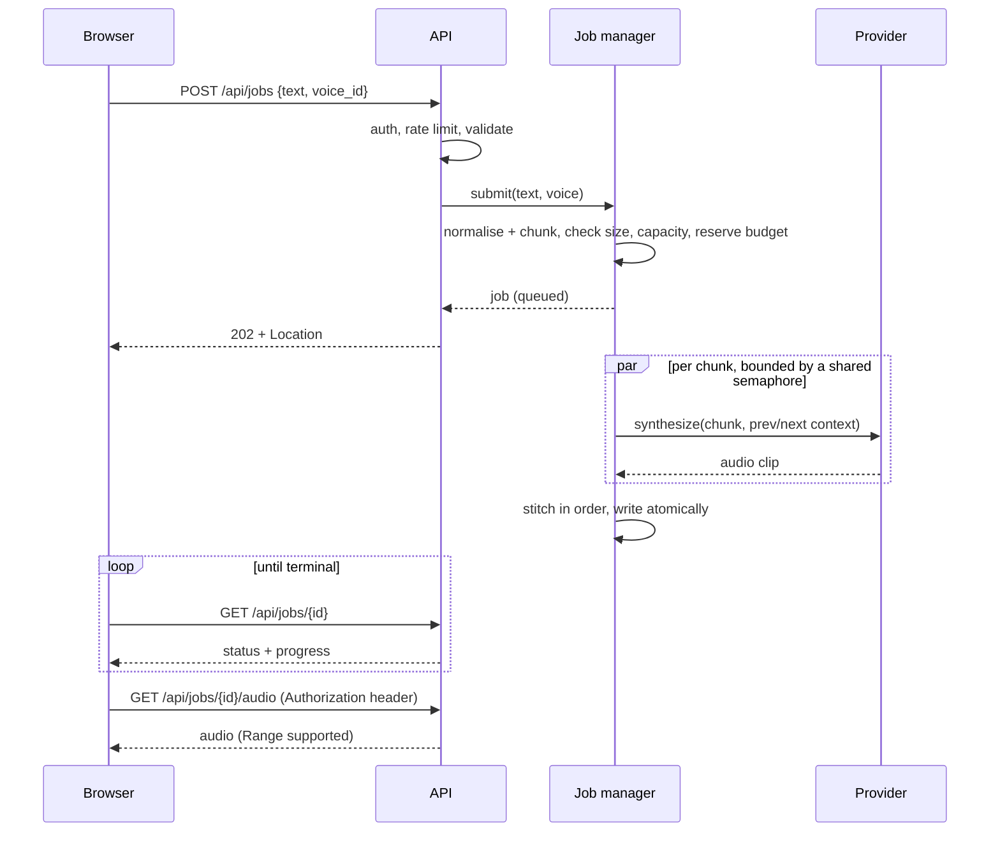

# Architecture

## Goals

1. Make the pipeline from "text" to "audio" correct and observable.
2. Treat the provider API key and credits as the assets worth protecting.
3. Keep the design small enough to read in an afternoon, and honest about where it would change at scale.

## Components

| Component | Responsibility | Why it is separate |
|---|---|---|
| `chunking` | Normalise text, split at natural boundaries | Pure function, so it can be property-tested exhaustively |
| `providers` | `TTSProvider` protocol, ElevenLabs client, demo provider | Provider specifics live in one file; the pipeline is testable offline; demo mode needs no key |
| `jobs` | Lifecycle, concurrency, budget accounting, expiry | The only stateful component; all policy lives here |
| `audio` | Duration estimates, lossless stitching | Isolates the ffmpeg subprocess and its fallback |
| `guards` | Sliding-window limiter, daily budget | Small, injectable clocks, so they are testable without sleeping |
| `storage` | Atomic, private writes keyed by server-generated ids | No user input ever reaches a filesystem path |
| `middleware` | Request id, access log, security headers, body limits | Cross-cutting, applied to every response including rejections |
| `api`, `deps` | Routes, auth dependency, error mapping | Thin: translate domain errors to HTTP |

## Request flow

## Concurrency model

- One `asyncio` task per job. A **job-slot semaphore** bounds how many jobs run at once.
- A **shared TTS semaphore** bounds outbound provider calls across *all* jobs. Providers enforce per-plan concurrency limits, so the limit belongs to the process, not to a job.
- Chunks of a job run in a `TaskGroup`. The first failure cancels the rest, which both returns the error quickly and stops spending credits on a job that cannot succeed.
- Results are written into a pre-sized list by index, so output order is independent of completion order. A test makes early chunks the slowest to prove it.

## Failure handling

| Failure | Behaviour |
|---|---|
| Timeout, connection error, 5xx | Retry with exponential backoff and full jitter, up to `TTS_MAX_RETRIES` |
| 429 | Retry honouring `Retry-After` (capped at 30 s) |
| 401/403, quota exhausted | Fail fast, no retry. The job fails with a public message; details go only to the redacted log |
| 4xx | Fail fast |
| Non-audio response | Treated as upstream failure, never stored |
| Redirect | Never followed, so the key cannot be sent to another host |
| Client cancels | Task cancelled, unspent characters refunded, audio removed |
| Process restart | In-flight jobs are lost. Orphaned files are purged at startup |

## Cost control

Credits are the real blast radius of a leaked or abused endpoint, so cost is bounded at several independent layers: per-job character cap, global daily budget (reserved at submit, refunded for chunks that did not complete), per-client rate limit, active-job cap and stored-job cap. Any one of them failing open is still limited by the others.

## Design decisions

- **Same-origin `/api`, no CORS by default.** In development Vite proxies to the API; in production FastAPI serves the built frontend. The browser never needs the provider's origin or a credential, and there is no cross-origin surface to configure wrongly.
- **Audio fetched with a header, played from a `blob:` URL.** `<audio src>` cannot send an `Authorization` header, and a token in a query string would end up in logs and history. The cost is buffering the file in the browser, which is acceptable for chapter-sized audio.
- **MP3 only for the real provider.** A constant bitrate lets duration be derived without decoding, and MP3 clips from one encoder concatenate cleanly. ffmpeg `-c copy` is used when present, with a byte-concatenation fallback.
- **Demo provider emits WAV.** WAV can be stitched in pure Python with the standard library, so the demo path and the entire test suite run with no ffmpeg and no network.
- **Settings validate at startup.** Anything that reaches a URL, header or path (base URL, model id, output format, voice id) is validated once, so injection through configuration fails at boot rather than at request time.
- **In-memory jobs.** The simplest correct design for one instance, and it keeps the lifecycle visible. The cost is stated under limitations.

## Scaling path

The seams are already in place.

1. **Queue.** Replace the in-process task with a worker consuming from Redis, SQS or similar. `JobManager.submit` becomes "persist and enqueue"; `_run` becomes the worker body. Job state moves to Redis or a database, which also fixes restarts.
2. **Object storage.** Replace `AudioStore` with S3 or R2 and return short-lived presigned URLs. This removes audio bandwidth from the API and lets the browser stream directly.
3. **Shared limits.** Move the rate limiter and daily budget to Redis (atomic `INCRBY` with expiry), so limits hold across replicas.
4. **Progressive playback.** Publish each clip as it completes and let the player start on chunk 1 while the rest render. The per-chunk ordering and context passing already support it.
5. **Observability.** Add Prometheus counters and histograms (job duration, chunk latency, retries by status, budget remaining). The structured logs and request ids already give correlation.
